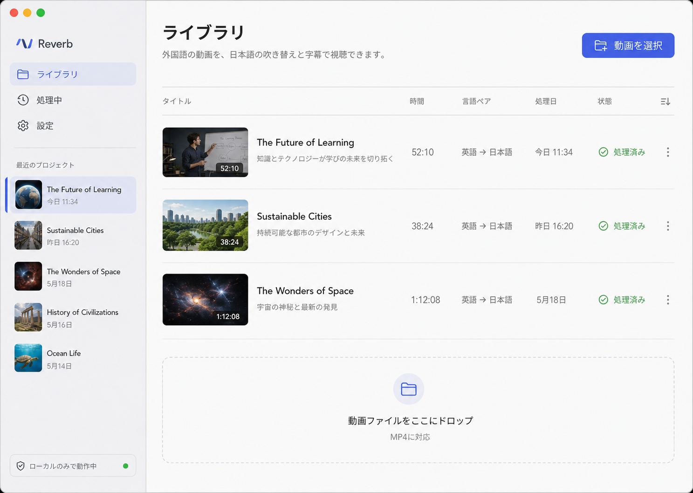
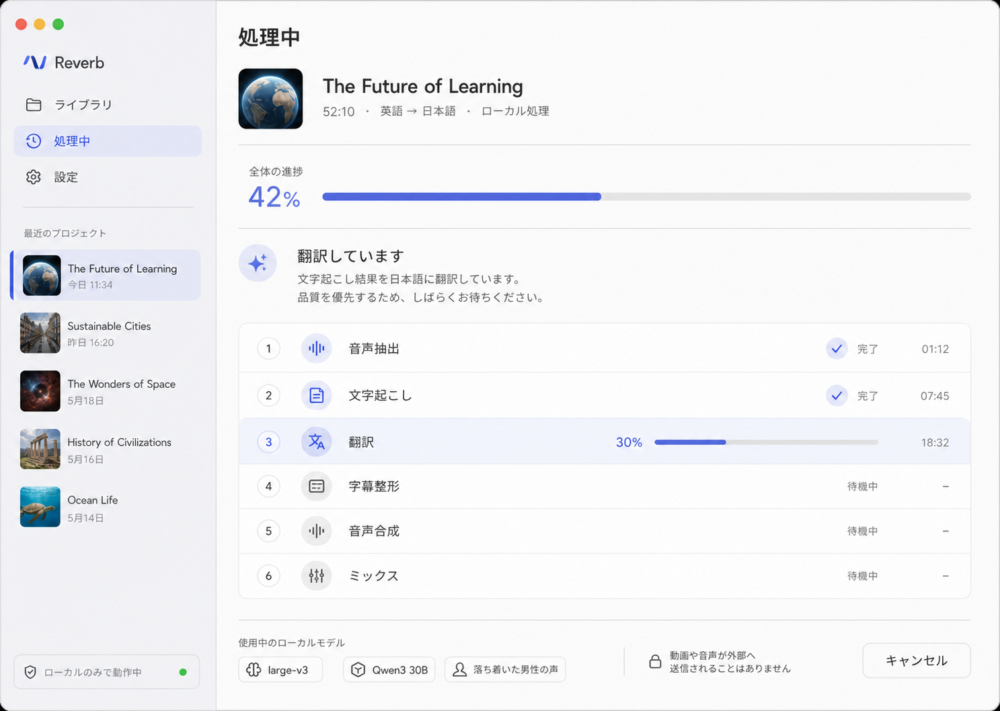
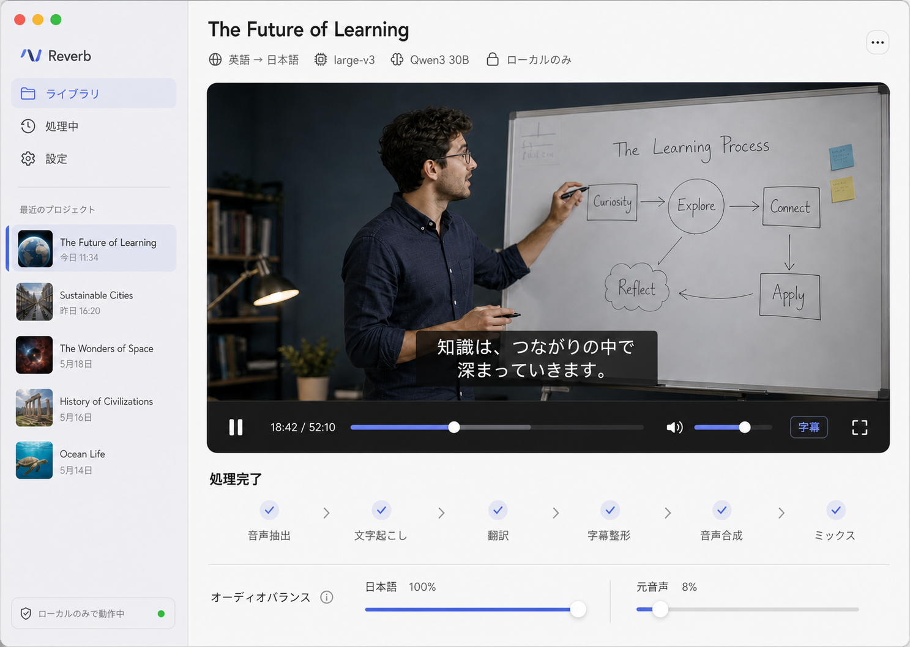
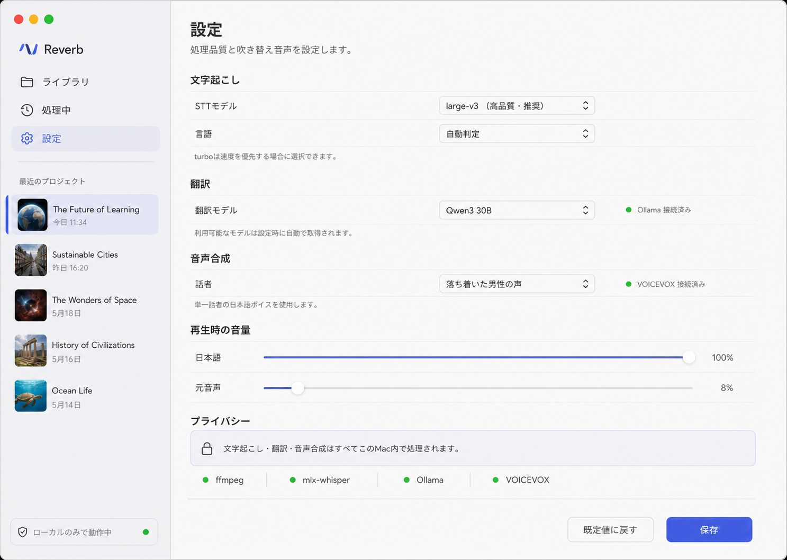

# Reverb 画面仕様

## 共通ナビゲーション

| 操作 | 遷移 |
|---|---|
| `ライブラリ` | ライブラリ画面 |
| `処理中` | 実行中または直近ジョブの処理画面 |
| `設定` | 設定画面 |
| 最近のプロジェクト | 完了ならプレーヤー、処理中なら処理画面 |

画面遷移中もサイドバーの選択、最近のプロジェクト一覧、ローカル状態を維持する。

---

## 1. ライブラリ



### 目的

ローカル動画を選び、新規処理を開始する。既存プロジェクトを再度開く。

### 表示

- タイトル `ライブラリ`
- 説明 `外国語の動画を、日本語の吹き替えと字幕で視聴できます。`
- 主要ボタン `動画を選択`
- プロジェクト一覧
- ドロップ領域 `動画ファイルをここにドロップ`
- 対応形式の補足 `MP4に対応`

### 操作

| 操作 | 結果 |
|---|---|
| `動画を選択` | `NSOpenPanel` を開く |
| MP4 をドロップ | 選択動画として受け付ける |
| プロジェクト行を選択 | 状態に応じて処理中またはプレーヤーへ遷移 |
| `…` | Finder で元動画を表示、プロジェクト情報を表示、プロジェクトを削除 |

ファイル書き出しは MVP の主要導線に置かない。削除はプロジェクト行の `…` から確認付きで実行する。

### API

新規動画を確定したら `POST /jobs` を呼ぶ。成功時は返却された `jobId` を使って処理中画面へ遷移する。

### 状態

- **空**: ドロップ領域を中央寄りにし、最初の動画選択を促す。
- **元動画なし**: 行に警告を表示し、元動画の再選択を促す。
- **作成失敗**: 理由をアラート表示し、入力内容を保持する。

---

## 2. 処理中



### 目的

品質優先の一括処理について、全体進捗と現在の工程を明確に伝える。

### 表示

- プロジェクトタイトル、再生時間、言語ペア
- 全体進捗率とプログレスバー
- 現在の工程名と短い説明
- 6工程の状態一覧
- 使用中モデル
- ローカル処理の説明
- `キャンセル`

### データ更新

- 第一候補: `GET /jobs/{id}/events` の SSE
- フォールバック: `GET /jobs/{id}` のポーリング
- 進捗更新は API 値を表示し、UI 側で工程の重みを再計算しない。

### 操作

`キャンセル` 選択時は確認ダイアログを出す。確定後、`POST /jobs/{id}/cancel` を呼ぶ。

### 状態

| API 状態 | UI |
|---|---|
| `queued` | `処理を準備しています` |
| `running` | 現在工程と進捗を表示 |
| `done` | 完了表示後、自動またはボタンでプレーヤーへ遷移 |
| `failed` | 失敗工程、`error.message`、再試行導線 |
| `canceled` | キャンセル済み表示、ライブラリへ戻る導線 |

再試行時は保存済み成果物を尊重し、バックエンドが返す再開位置を UI に表示する。

---

## 3. プレーヤー



### 目的

元映像、日本語吹き替え、日本語字幕を同一時間軸で再生する。

### 表示

- プロジェクトタイトル
- 言語、STT モデル、翻訳モデル、ローカル状態
- 16:9 プレーヤー
- 日本語字幕
- 再生コントロール
- 完了した6工程
- オーディオバランス

### 再生コントロール

- 再生 / 一時停止
- 現在時刻 / 全体時間
- シーク
- 全体音量
- 字幕 ON / OFF
- フルスクリーン

シーク後は映像、吹き替え、元音声、字幕を同じ時刻へ追従させる。

### 字幕

- 現在時刻が cue の `[start, end)` に含まれる場合に表示する。
- `lines` 配列をそのまま描画する。
- 画面幅不足でも3行目を作らず、字幕フォントを許容範囲内で縮小する。
- 字幕 OFF は表示だけを切り替え、音声や再生位置に影響させない。

### オーディオ

- 初期値は日本語 **100%**、元音声 **8%**。
- 再生中に変更できる。
- UI は音量変更を再処理として扱わない。
- 2系統再生を採用する場合も、ユーザーには実装方式を見せない。

### 読み込み・エラー

- 成果物取得: `GET /jobs/{id}/result`
- 元動画が移動済み: 再選択を促し、プロジェクト成果物は保持する。
- 吹き替え音声が読めない: 再生を開始せず、再処理を案内する。
- 字幕のみ欠落: 動画と音声は再生可能とし、字幕エラーを明示する。

---

## 4. 設定



### 目的

処理品質、翻訳モデル、TTS 話者、再生時の初期音量を設定する。

### 項目

| セクション | 項目 | 既定 |
|---|---|---|
| 文字起こし | STT モデル | large-v3 |
| 文字起こし | 言語 | 自動判定 |
| 翻訳 | 翻訳モデル | バックエンド既定 |
| 音声合成 | 話者 | バックエンド既定の落ち着いた男性の声 |
| 再生時の音量 | 日本語 | 100% |
| 再生時の音量 | 元音声 | 8% |

### データ取得

- 翻訳モデル: `GET /models`
- TTS 話者: `GET /speakers`
- 依存状態: `GET /health`

モデル名、タグ、話者 ID を UI コードへ固定しない。API が返した表示名と既定値を使用する。

### 保存

- `保存`: 次回の `POST /jobs` に渡す既定設定としてローカル保存する。
- `既定値に戻す`: バックエンド既定値を再取得してフォームへ反映する。
- 既存プロジェクトへの設定変更は自動適用しない。再処理が必要な場合は、影響する下流工程を説明して確認を取る。

### 依存エンジン

`ffmpeg`、`mlx-whisper`、`Ollama`、`VOICEVOX` の状態を表示する。未接続時は該当設定を無効化し、起動や確認が必要であることを説明する。外部サービスへの誘導は行わない。

---

## 5. SwiftUI 構成案

UI 層に処理ロジックを持ち込まない。

```text
AppShell
├── AppSidebar
└── Content
    ├── LibraryView
    ├── ProcessingView
    ├── PlayerView
    └── SettingsView
```

共通表示部品:

- `ProjectRow`
- `LocalOnlyStatus`
- `StageProgressList`
- `VideoPlayerContainer`
- `SubtitleOverlay`
- `AudioBalanceControl`
- `DependencyStatusRow`

ViewModel はローカル HTTP クライアントを通して状態を取得し、View は描画とユーザー操作の通知だけを担当する。

## 6. 受け入れ基準

- 4画面でサイドバー、余白、色、文字階層が一貫している。
- 新規動画から処理中、完了後の再生まで移動できる。
- 6工程が仕様どおりの順序で表示される。
- 日本語100% / 元音声8% が初期表示される。
- 字幕が最大2行で、UI 側で文面を再分割しない。
- 翻訳モデルと話者一覧を API から取得する。
- ローカル処理状態を常時確認できる。
- スコープ外機能が画面に現れない。
- キーボード操作と VoiceOver で主要操作を利用できる。

